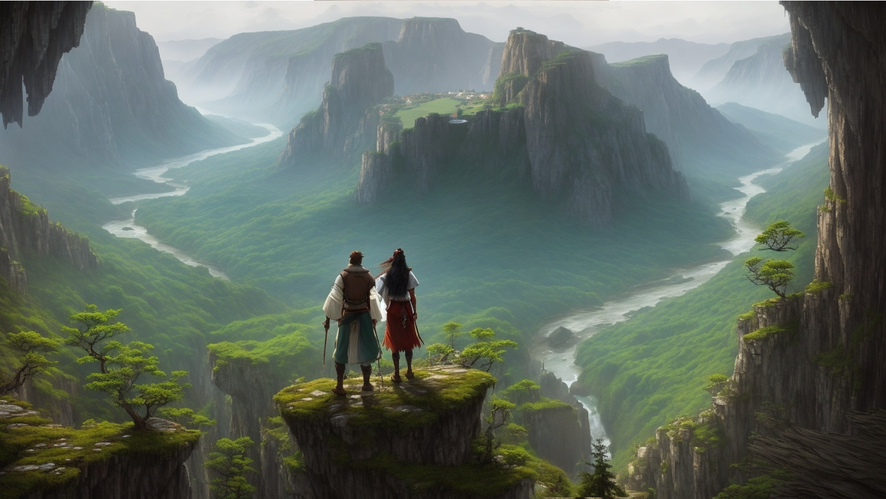

# Introduction

## What is The Divine Reborn?

The Divine Reborn is a sandbox fantasy-themed MMO set in a world that has been reborn from the ashes of a cataclysmic war. The war was caused by the demons, who exploited man’s greed and lust for power, and provoked the wrath of the gods. The planet has been broken into pieces, where life has found a way to continue and evolve. Man has also discovered the secrets of the divine power that flows through the world, and uses it to shape their destiny. The world has a strong resemblance to the Tenshō period of Japan, around 1570 to 1590, where feudalism, culture, religion, and magic flourished. Players can experience this unique and complex world, where history and fantasy collide with divinity and darkness.

## Game World

The game world is a collection of floating islands, each with its own unique environment, inhabitants, and resources. The islands are connected by portals that players can use to travel between them. See [Lore/World](/lore/world).

## Gameplay Overview

The game is an Survival-action MMORPG that incorporates action-based combat, combo systems, and an intricate skill system that allows for unique skills based on the player's playstyle. Terrain and weather will also affect combat. Players can choose from a variety of roles, including melee classes, ranged classes, mage classes, tank classes, and support classes. 

## Player Progression

Players start as a basic character and can choose their role from a selection of classes, including warrior, rogue, mage, tank, support, and damage dealer. As players level up, they earn experience points that they can use to enhance their skills and abilities. 

*Players will use experience points indefinitely but will have a soft cap that allows for extra experience points gained to be used as currency for further gaining skills and abilities as well as convenience items.*  

**-- Under discussion --**

## Crafting System

All items in the game will be craftable, players can obtain materials through combat, gathering, or trading with other players. Crafted items of a certain rarity will be unique, and there will be different ways to obtain materials, integrated with the divine essence system. 

## Divine Essence

The divine essence is the power source for the Talent Forge and other machines in the game world. Players can obtain divine essence through combat, gathering or trading with other players. The divine essence can be used to enhance skills and abilities, modify spells, and create unique items. 

**-- Under discussion; talent forge --**

## Combat System

The game features an action-based combat system with combos and an intricate skill system. Players can chain skills together to increase the efficiency and modify spells. The combo system allows players to chain skills for more damage, like an arcade fighting game. The terrain, other players and weather can also affect the combat system. 

**-- Fast paced action, will be removed in favor for a more paced (not slow) and stratigic approach, more like GW2, 1-5 skills with varying stamina use and cooldown timers --**

## Graphics

The graphics will be high-quality and immersive, with a focus on detailed character models, rich environments, and special effects that make the use of divine essence and magic feel powerful and impactful. 

## Conclusion

The Divine Reborn is a very dynamic and immersive MMORPG that offers players an engaging fantasy world to explore. With a focus on player choice and customization, the game offers endless possibilities for player progression and adventure. 

import Disclaimer from './../components/disclaimer'

<Disclaimer />