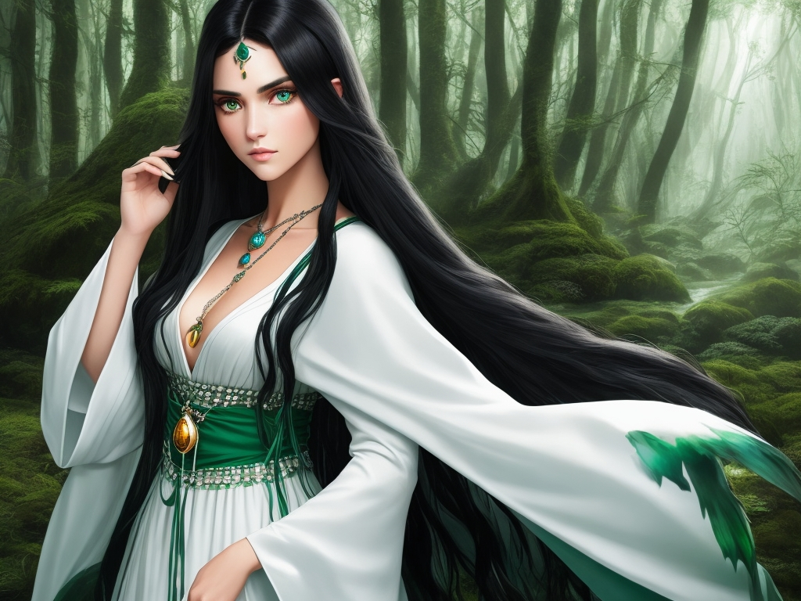

# Characters

## Example character with a backstory

Name: Kira Gender: Female Age: 18 Class: Mage Appearance: A young woman with long black hair and green eyes. She wears a simple white robe and a pendant with a blue gem. Personality: Curious, adventurous, and optimistic. She loves to learn new things and explore new places. She is friendly and helpful, but also naive and impulsive. Background: Kira was born in a small village in the mountains, where she lived with her grandfather, who was a scholar and a mage. He taught her how to read, write, and use magic. He also told her stories about the world before the war, and the divine power that lies within it. Kira dreamed of seeing the world for herself, and finding out more about the divine power. One day, her grandfather gave her a pendant with a blue gem, which he said was a gift from the gods. He told her that it was a key to unlock the secrets of the world, and that she should follow her heart and seek her destiny. He also warned her of the dangers of the demons, who would stop at nothing to get the pendant. The next day, he passed away peacefully in his sleep. Kira decided to honor his wishes and leave the village, taking only the pendant and a few belongings. She joined a caravan of travelers heading to the nearest city, where she hoped to find more clues about the pendant and the divine power.